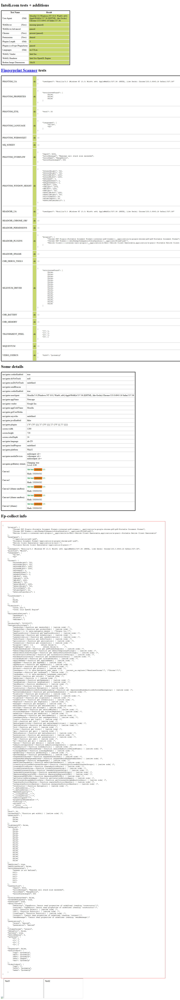

# playwright-stealth-java

A Java library written with reference to the Python library [playwright_stealth](https://github.com/Mattwmaster58/playwright_stealth).

> Don't expect this to bypass anything but the simplest of bot detection methods. Consider this a proof-of-concept starting point.

## Introducing dependencies

### Maven

```xml

<dependency>
    <groupId>io.github.shitlime</groupId>
    <artifactId>playwright-stealth-java</artifactId>
    <version>latest</version>
</dependency>
```


### Gradle

```kotlin
implementation('io.github.shitlime:playwright-stealth-java:latest')
```


## Example

```java
public static void main(String[] args) {
    try (Playwright playwright = Playwright.create()) {
        Stealth stealth = new Stealth();    // Create a Stealth instance
        Browser browser = playwright.chromium().launch();
        BrowserContext browserContext = browser.newContext();
        stealth.applyStealth(browserContext);    // Applied to the browser context
        Page page = browserContext.newPage();
        page.navigate("https://bot.sannysoft.com/");
        byte[] screenshot = page.screenshot(new Page.ScreenshotOptions().setFullPage(true));
        FileOutputStream fos = new FileOutputStream(new File("./test-output.png"));
        fos.write(screenshot);
        fos.close();
    } catch (Exception e) {
        e.printStackTrace();
    }
}
```

## Test results

